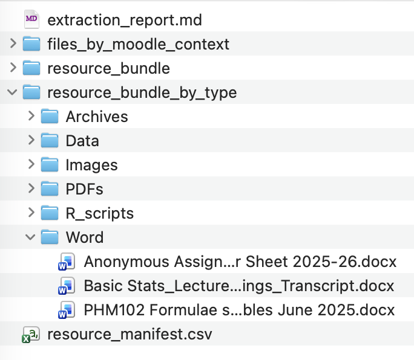

# CloudPedagogy Moodle File Extractor

Extract files from Moodle `.mbz` backups, restore their original filenames and paths, verify file integrity, and create a CSV manifest.

Moodle stores backed-up files using content hashes. This script reads `files.xml` and reconstructs the filenames and metadata recorded in the backup.

## Features

- Restores original filenames and Moodle paths
- Extracts PDFs, documents, images, media and other resources
- Preserves component, file area and item identifiers
- Prevents duplicate filenames from overwriting each other
- Optionally verifies files against their Moodle SHA-1 hashes
- Generates `moodle_file_manifest.csv`
- Uses only the Python standard library

## Example output

The extractor recovers Moodle files and presents them through complementary course, technical-context and file-type views.



*Example output showing the recovered Moodle resources and generated documentation.*

## Requirements

- Python 3.9 or later
- A Moodle `.mbz` course backup

## Installation

```bash
git clone https://github.com/cloudpedagogy/cloudpedagogy-moodle-file-extractor.git
cd cloudpedagogy-moodle-file-extractor
```

No additional packages are required.

## Usage

Place the backup in an input folder:

```text
cloudpedagogy-moodle-file-extractor/
├── extract_moodle_files.py
├── imports/
│   └── source_mbz/
│       └── backup-moodle2-course-example.mbz
└── output/
```

Run:

```bash
python3 extract_moodle_files.py \
  imports/source_mbz/backup-moodle2-course-example.mbz \
  --output output/example_course_resources \
  --verify-hashes
```

The input can also be an already-extracted Moodle backup directory containing `files.xml`.

## Output

```text
output/example_course_resources/
├── files/
│   └── component/filearea/itemid/original_filename.pdf
└── moodle_file_manifest.csv
```

The structured folders preserve Moodle context and reduce filename collisions.

The manifest records the original filename and path, component, file area, item and context IDs, content hash, file type, size, extracted path and extraction status.

A successful run reports:

```text
Extracted 100 files; 0 missing; 20 directory records skipped.
```

Directory records represent Moodle folders and are not downloadable files.

## Options

| Option | Purpose |
|---|---|
| `--output`, `-o` | Set the output directory. |
| `--verify-hashes` | Verify extracted files against Moodle SHA-1 hashes. Recommended. |
| `--flat` | Put all files in one folder; duplicate names are safely renamed. |
| `--include-directories` | Recreate empty directory records. |
| `--overwrite-output` | Allow extraction into a non-empty output directory. |
| `-h`, `--help` | Display command help. |

Example flat extraction:

```bash
python3 extract_moodle_files.py backup.mbz \
  --output output/resources_flat \
  --verify-hashes \
  --flat
```

## Manifest status values

| Status | Meaning |
|---|---|
| `extracted` | File copied successfully. |
| `directory_record` | Moodle folder metadata; no file to copy. |
| `missing` | Metadata exists, but file content is absent. |
| `hash_mismatch` | Extracted bytes do not match Moodle's recorded hash. |

## Troubleshooting

**Script not found**

```bash
find . -name "extract_moodle_files.py"
```

Use the returned path in the command.

**Output directory is not empty**

Choose a new output name or add `--overwrite-output` if using the existing folder is intentional.

**All files reported missing**

Check whether the backup contains file data:

```bash
tar -tf backup.mbz | grep -E '(^|/)files/' | head -20
```

If no file paths appear, the backup may contain metadata without the corresponding file content.

## Limitations

Filenames and paths come directly from Moodle metadata and are not guessed. The script retains Moodle identifiers but does not currently translate every item ID into a human-readable activity or course-section name.

## Licence

Add the chosen repository licence, such as MIT, in a `LICENSE` file.
